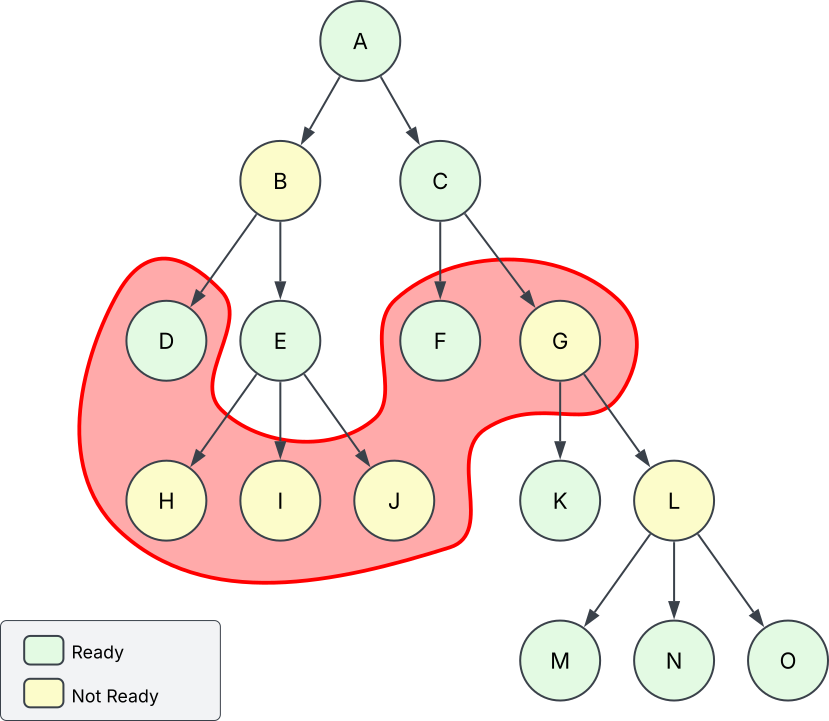
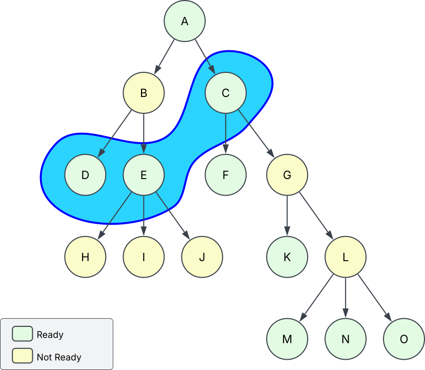
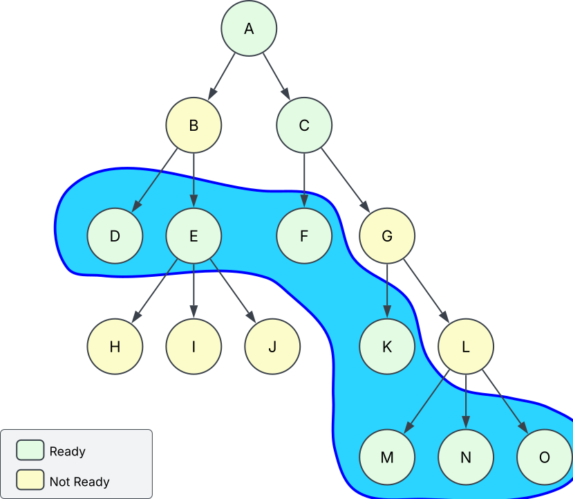

# Frontier API Guide

Frontier is a C++20 library that chooses which level-of-detail (LOD) nodes a
renderer should draw from a large dynamic scene. It owns the spatial index,
reusable hierarchy topology, and the rules that preserve a complete renderable
result while GPU resources and finer hierarchy stream. The application still
owns rendering, resource loading, payload interpretation, and the policy that
decides where finer hierarchy should be attached.

This guide introduces the system in the order an integration normally uses it.
The exhaustive type and function contracts are in
[API_REFERENCE.md](API_REFERENCE.md).

The normal entry points are:

```cpp
#include <frontier/builder.h>
#include <frontier/spatial_database.h>

using namespace frontier;
```

## 1. What Frontier provides

A conventional LOD system can choose one mesh for one object. Frontier makes
the same decision across an assembled hierarchy: a city can refine into blocks,
a block into reusable buildings, and a building into reusable detail trees.
Definitions are shared and placements are independent. When a selected node is
not ready, Frontier uses a complete ready descendant cut when one exists;
otherwise it falls back to the nearest ready ancestor. Either path preserves
coverage without leaving holes.

### The two spatial levels

A bounding-volume hierarchy (BVH) groups spatial bounds so a query can reject
many objects or nodes without testing each one. Frontier uses two logical
levels:

- The **top-level acceleration structure (TLAS)** is an internal 8-wide BVH in
  world space. It indexes independently movable top-level instances. Every TLAS
  leaf is also that instance's permanent, renderable fallback node.
- A **subtree definition** is an immutable local-space hierarchy registered
  once and mounted wherever it is needed. In conventional ray-tracing
  terminology this is the BLAS-like, or bottom-level, part of the system.
  Frontier calls it a subtree definition rather than a BLAS because definitions
  can be mounted recursively below other definitions instead of forming one
  fixed lower tree per object.

The resulting runtime shape is:

```text
world-space TLAS
`-- top-level instance / permanent renderable root
    `-- mounted subtree definition
        `-- mountable renderable node
            `-- another mounted subtree definition
```

The TLAS first finds visible top-level instances. Frontier then enters their
mounted local hierarchies only when their roots need finer LOD. This separation
keeps world movement out of shared local topology, lets many placements reuse
one definition, and makes a one-node object require no bottom-level hierarchy
at all.

### Nodes, errors, and cuts

Each hierarchy node is a renderable representation of everything below it. Its
geometric error estimates how far that representation can deviate from finer
detail. A query projects that error into screen pixels and refines while it is
above `SelectionParams::threshold`.

A **frontier**, also called a **cut**, is the set selected by that process. No
selected node is an ancestor of another, and together the selected nodes cover
the visible scene. Frontier produces two cuts at once:

- the **current cut** is hole-free and renderable with resources available now;
- the **ideal cut** is what the currently mounted topology would select if all
  of its nodes were render-ready.

**Hole-free** means complete hierarchy coverage: every visible region represented
by a selected parent remains represented either by that parent or by a complete
set of selected descendants. Frontier never drops a parent merely because some
children are ready; it refines only when ready descendants cover every visible
branch that the parent covered. This is a selection guarantee, not a claim about
geometric cracks between meshes, occlusion, or rasterization.

A node's `payload` is only an opaque application identifier. **Readiness** says
whether the renderer can dispatch that node's payload; it does not mean that
finer topology has been mounted. When a desired node is not ready, the current
cut remains at a ready ancestor or uses a complete set of ready descendants.

Importantly, readiness is not required at every level of the hierarchy. An
unavailable ancestor does not block its descendants: if those descendants form
a complete ready cut, Frontier can render them directly. It falls back upward
only when descendant readiness is incomplete.

With that model, the smallest useful scene needs only a permanent top-level
node:

```cpp
SpatialDatabase database;

InstanceHandle rock = database.instantiate(
    NodeDesc{
        .payload = 1001,              // application resource/data id
        .geometricError = 0.0f,       // no finer representation
        .bounds = rockLocalBounds,
    },
    InstanceDesc{
        .pos = float4::point(40.0f, 0.0f, -12.0f),
        .scale = 1.0f,
        .mask = ~0u,
    });

database.applyUpdates();

SpatialQuery query;
Camera camera = makeLookAtCamera(cameraPosition, cameraTarget);
FrontierResultView cut = query.selectFrontier(
    database, camera, SelectionParams{.threshold = 4.0f});

for (const FrontierEntry& entry : cut.current())
    submitToRenderer(entry);
```

The rock's root lives directly in the TLAS. Because it has no finer hierarchy,
it allocates no subtree definition or mounted-placement state.

## 2. The architecture in one pass

Frontier separates immutable authored data from mutable placement data:

| Concept | What it represents | Ownership and mutability |
|---|---|---|
| node | one renderable representation of a hierarchy region | payload, error, flags, and authored bounds |
| top-level instance | one permanent renderable root in the TLAS | mutable translation, uniform scale, mask, and world bound |
| subtree definition | one reusable BLAS-like descendant hierarchy | immutable registered serialized bytes |
| mounted placement | one definition attached below one renderable node | accumulated transform and state for mounted descendants |
| spatial query | one camera/view selection | owns per-view selection state, scratch, and output |

An expandable node is called a **mountable node** by the API. It is both a real
renderable fallback and a legal attachment point. It must be a leaf within its
own definition; a different registered definition may be mounted below it at
runtime.

```cpp
SubtreeHandle houseDefinition = /* registered once */;

NodeHandle firstHouseProxy  = /* discovered in an ideal frontier */;
NodeHandle secondHouseProxy = /* another placement's proxy */;

SubtreeInstanceHandle firstHouse =
    database.mountSubtree(firstHouseProxy, houseDefinition,
                          firstHouseLocalTransform);
SubtreeInstanceHandle secondHouse =
    database.mountSubtree(secondHouseProxy, houseDefinition,
                          secondHouseLocalTransform);
```

Both placements share the house's immutable topology, bounds, errors, payload
values, and definition-node readiness. Each placement can have different
mounted descendants and therefore logically different coverage. Here,
**coverage** is Frontier's internal proof that a node is ready itself or has a
complete ready descendant cut. Childless placements share the definition's
coverage summary; the first mounted descendant creates a private copy on write.

Four rules explain most of the architecture:

1. Every top-level instance has exactly one permanent renderable root.
2. A subtree definition contains descendants, not a replacement for that root.
3. Definitions are immutable and shareable; placements are mutable and unique.
4. Topology availability and render readiness are independent.

## 3. Describe one renderable node

`NodeDesc` is used both for TLAS roots and for nodes authored by a
`SubtreeBuilder`:

```cpp
NodeDesc proxy{
    .payload = buildingProxyPayload,
    .geometricError = 32.0f,
    .flags = NodeDesc::FlagMountable,
    .bounds = buildingBounds,
};
```

- `payload` is an opaque application render-resource identifier. Equal values
  may identify the same resource, but do not couple library readiness state.
- `geometricError` is the authored deviation from finer detail, expressed in
  the node hierarchy's local units. Frontier scales and projects it for the
  current camera; zero means this node has no error-driven reason to refine.
- `FlagMountable` makes the node an expandable assembly boundary.
- `bounds` is exact six-float authoring storage and accepts an `AABB` directly.

The descriptor occupies 40 bytes. The 32-bit flag word currently defines only
`FlagMountable`; the remaining bits are reserved for future node properties.

```cpp
if (proxy.isMountable()) {
    AABB exactBounds = proxy.bounds;  // exact conversion, no quantization
    scheduleDefinitionLookup(proxy.payload, exactBounds);
}
```

## 4. Author a reusable subtree

`SubtreeBuilder` creates a hierarchy in edit mode. A builder node id exists only
while authoring and is unrelated to a runtime `NodeHandle`.

```cpp
SubtreeBuilder buildingBuilder;
buildingBuilder.reserve(3); // optional allocation hint

SubtreeBuilder::NodeId coarse = buildingBuilder.createNode(NodeDesc{
    .payload = buildingCoarsePayload,
    .geometricError = 24.0f,
    .bounds = buildingBounds,
});

buildingBuilder.createNode(coarse, NodeDesc{
    .payload = buildingLeftPayload,
    .geometricError = 0.0f,
    .bounds = buildingLeftBounds,
});

buildingBuilder.createNode(coarse, NodeDesc{
    .payload = buildingRightPayload,
    .geometricError = 0.0f,
    .bounds = buildingRightBounds,
});

SubtreeBytes buildingBytes = buildingBuilder.build();
```

`createNode(desc)` creates a direct child of the node on which the eventual
definition is mounted. `createNode(parent, desc)` creates a local child of an
earlier builder node. A definition may therefore have several direct nodes; the
serialized representation uses an internal implicit-parent sentinel to keep
those roots contiguous. The sentinel is never renderable and has no public
handle.

`build()` consumes the builder and verifies the authored hierarchy:

- at least one renderable node exists;
- error values are finite and non-negative;
- every final node bound is non-empty;
- no local child exists below a mountable node;
- local fanout is at most 511;
- child error is clamped monotonically to its parent's error.

An interior node may start with empty bounds if its children establish a
non-empty result:

```cpp
SubtreeBuilder generated;
auto parent = generated.createNode(NodeDesc{
    .payload = generatedProxy,
    .geometricError = 64.0f,
    .bounds = AABB::empty(),
});
for (const GeneratedPart& part : parts)
    generated.createNode(parent, part.nodeDesc());

SubtreeBytes bytes = generated.build(); // parent bounds include its children
```

## 5. Serialized subtrees and memory ownership

`SubtreeBytes` is an owning, 64-byte-aligned byte array. The builder's output is
simultaneously:

- the serialized file representation;
- the registration input;
- the immutable in-memory traversal representation.

Registration validates the header, layout, version, size, alignment, and
implicit-parent sentinel, then moves the existing allocation. It does not
unpack or copy the node arrays and does not allocate per-node runtime state.
The bounded direct-root classification is independent of the definition's
total descendant count, and ownership transfer of the byte array is
constant-time. Shared readiness/coverage state is allocated lazily on the
definition's first mount.

```cpp
SubtreeBytes bytes = buildBuildingDefinition().build(context);
writeAll("building.frontier", bytes.bytes()); // application file function

SubtreeHandle building = database.registerSubtree(std::move(bytes));
```

A temporary can be registered directly:

```cpp
SubtreeHandle building =
    database.registerSubtree(buildBuildingDefinition().build(context));
```

Loading allocates the final array before reading:

```cpp
SubtreeBytes bytes(fileSize("building.frontier"), context);
readAll("building.frontier", bytes.bytes()); // application file function

SubtreeHandle building = database.registerSubtree(std::move(bytes));
```

Persisted bytes are a versioned native traversal format, not a long-term
interchange schema. Registration rejects incompatible format versions, layout,
size, alignment, or byte order; rebuild authored assets when those change. The
validation is a compatibility check, not a hardened parser for untrusted
input, so load bytes produced by a trusted authoring pipeline.

Important ownership rules:

- a named `SubtreeBytes` requires `std::move` at registration;
- registering identical bytes twice creates two independent definitions;
- `releaseSubtree()` requires that no mounted placements still reference the
  definition;
- the state referenced by `FrontierContext::user` must outlive every byte array
  and registered definition allocated with that context.

`SubtreeBytes` is explicitly copyable for tools that need duplicate byte
arrays, but registration exposes only the ownership-taking rvalue overload.

## 6. Create a root and mount a definition

Every independently movable object begins with `instantiate()`. Set
`FlagMountable` when a deeper definition will attach below the root.

```cpp
InstanceHandle city = database.instantiate(
    NodeDesc{
        .payload = cityFallbackPayload,
        .geometricError = 128.0f,
        .flags = NodeDesc::FlagMountable,
        .bounds = cityLocalBounds,
    },
    InstanceDesc{
        .pos = cityWorldPosition,
        .scale = 1.0f,
        .mask = cityLayerMask,
    });

SubtreeInstanceHandle cityPlacement = database.mountSubtree(
    city.rootNode(), cityDefinition,
    Transform{.pos = float4::point(0, 0, 0), .scale = 1.0f});
```

A mount parent can be either a mountable TLAS root or a mountable leaf in an
existing placement. Mounting verifies that the transformed definition bounds
fit inside the parent and applies the parent's effective error as a ceiling.
The definition bytes are never rewritten.

```cpp
if (!database.hasMountedSubtree(houseProxy)) {
    SubtreeInstanceHandle house = database.mountSubtree(
        houseProxy, houseDefinition,
        Transform{.pos = houseOffsetInBlock, .scale = houseScale});

    if (!house.valid())
        handleExpectedStreamingRace(); // proxy became stale while loading
}
```

An invalid result caused by a stale parent is an expected asynchronous race.
Mounting on a live non-mountable parent, mounting twice, escaping the parent
bounds, or using an invalid definition is a contract violation.

Mount transforms are translation plus positive uniform scale and accumulate
across nested placements.

## 7. Select the current and ideal frontiers

Mutations become queryable at an update barrier:

```cpp
database.applyUpdates();

SpatialQuery mainView;
mainView.setHalfLife(3.0f); // optional view-local LOD damping

FrontierResultView cut = mainView.selectFrontier(
    database,
    cameraFromViewProjection(viewProjection, cameraPosition,
                             viewportHeight, projectionYScale),
    SelectionParams{
        .threshold = 4.0f,
        .minPix = 0.0f,
        .currentCutPolicy = CurrentCutPolicy::PreferReadyDescendants,
    });
```

`threshold` is the desired maximum projected geometric error in pixels: lower
values refine more aggressively. `minPix` optionally rejects top-level
instances whose projected contribution is too small. Query-local **damping**
smooths LOD decisions over camera motion by evaluating a conservative temporal
camera envelope; it does not modify scene state. The query's reuse cache is a
separate optimization that returns a previous exact cut while its recorded
decision margins remain valid.

`currentCutPolicy` controls how an unavailable ideal choice is replaced:

- `PreferReadyDescendants` uses a complete ready descendant cut when one
  exists, falling back to a ready ancestor only when that cover is incomplete.
  This default normally preserves the most detail.
- `PreferReadyAncestors` never searches below the unavailable ideal choice. It
  falls back upward, normally producing a smaller but coarser current cut.

One traversal returns two logical cuts in three disjoint buckets:

- `shared` belongs to both current and ideal cuts;
- `currentOnly` contains ready fallbacks used only now;
- `idealOnly` contains choices wanted if all known definition nodes were ready.

### Two current-cut policies

The following three diagrams show the same hierarchy and camera decision.
Green nodes are ready, yellow nodes are unavailable, and the colored region
marks the selected frontier.

The ideal frontier is `D, H, I, J, F, G`. It is the desired LOD result, but it
cannot be rendered in this example because `H`, `I`, `J`, and `G` are not
ready:



`PreferReadyAncestors` produces the compact current frontier `D, E, C`.
Unavailable `H/I/J` retreat to their ready ancestor `E`; unavailable `G`
retreats to `C`. Selecting `C` also replaces its ready child `F`, because a cut
cannot contain both an ancestor and its descendant:



`PreferReadyDescendants` produces the detailed current frontier
`D, E, F, K, M, N, O`. The complete ready descendant cut `K, M, N, O` covers
the unavailable `G`, so `F` can remain selected independently. If even one
visible branch below `G` lacked ready coverage, Frontier would fall back to
the ready ancestor `C` instead:



Render the zero-copy current-cut view:

```cpp
for (const FrontierEntry& entry : cut.current()) {
    UserPayload payload;
    if (database.tryGetPayload(entry.nodeHandle, payload))
        submitPayload(payload, entry.instance());
}
```

Use the corresponding ideal-cut view to drive demand:

```cpp
for (const FrontierEntry& entry : cut.ideal()) {
    UserPayload payload;
    if (database.tryGetPayload(entry.nodeHandle, payload) &&
        !database.isNodeReady(entry.nodeHandle))
        requestPayload(entry.nodeHandle, payload);

    if (entry.overThreshold() &&
        !database.hasMountedSubtree(entry.nodeHandle))
        requestChildDefinition(entry.nodeHandle);
}
```

`current()` iterates `shared` followed by `currentOnly`; `ideal()` iterates
`shared` followed by `idealOnly`. Both are allocation-free forward ranges over
the original spans. The individual buckets remain public for bulk submission
and code that needs only the delta between the cuts.

`FrontierResultView` points into its `SpatialQuery` and remains valid until that
query's next selection, `reset()`, or destruction. Use `FrontierResult` for an
owning copy or `FrontierResultSink` to write directly into fixed caller memory.

Each `FrontierEntry` carries a generation-stamped `NodeHandle`, an
`InstanceId` stable for the lifetime of its top-level instance, and a
threshold-relative error code. The instance id is appropriate for indexing the
application's top-level transform or entity table while that instance is live.

## 8. Stream topology and render readiness independently

Mounting makes finer topology known. Marking a node ready says the renderer has
every GPU resource needed to dispatch that node's payload. These operations
intentionally happen at different times.

### Example: readiness follows GPU resources

Suppose a building hierarchy is already mounted and therefore known to
Frontier, but some wall meshes or materials are not in GPU memory yet. The
current cut uses ready ancestors as fallbacks; `idealOnly` identifies choices
that belong to the ideal cut but not the current cut. Start GPU demand there,
without revisiting `shared` entries that are already usable in both cuts:

```cpp
for (const FrontierEntry& entry : cut.idealOnly) {
    if (database.isNodeReady(entry.nodeHandle))
        continue; // a ready sibling can still be ideal-only

    UserPayload payload;
    if (database.tryGetPayload(entry.nodeHandle, payload))
        gpuStreamer.request(entry.nodeHandle, payload);
}

// Applied later, during a writer phase after the upload finishes.
for (const GpuCompletion& completed : gpuStreamer.completed())
    database.markNodeReady(completed.node);
```

The readiness test is still necessary. If one child is unavailable, the
hole-free current cut may remain at a common ancestor; ready siblings below
that ancestor then also appear in `idealOnly` even though they need no upload.
No topology is mounted or unmounted in this example.

The reverse is equally important. A coarse building node may become unavailable
after all of its wall descendants are ready. Because those walls form a
complete ready cut, the current frontier keeps rendering them; it does not
require the coarse ancestor to remain ready. Only a gap in that descendant cut
forces selection back to a ready ancestor.

### Example: mounting reveals local detail

Now consider a planet-scale hierarchy. From orbit, the database needs only the
planet, continent, and coarse terrain nodes. Individual city blocks, buildings,
and walls do not need to be known at all. As the camera approaches the surface,
an over-threshold mountable proxy in the ideal cut asks the application to load
and mount its child definition:

```cpp
for (const FrontierEntry& entry : cut.ideal()) {
    UserPayload payload;
    if (!database.tryGetPayload(entry.nodeHandle, payload))
        continue;

    if (entry.overThreshold() && planetContent.isExpandable(payload))
        topologyStreamer.request(entry.nodeHandle,
                                 planetContent.childAsset(payload));
}

// Applied later, during the writer phase.
for (TopologyCompletion& completed : topologyStreamer.completed()) {
    SubtreeHandle detail = definitionCache.getOrRegister(
        completed.asset, database);
    database.mountSubtree(completed.parent, detail, completed.transform);
}
```

Topology demand inspects `ideal()`, not only `idealOnly`. Until the child is
mounted, the known ideal frontier itself stops at the proxy; that proxy can be
`shared` because it is also the best current representation. Its over-threshold
error is what signals that more topology is wanted. The application's request
queue should coalesce repeated requests while the child definition is loading.

After mounting, the next selection can expose much finer nodes around the
camera. Those nodes are commonly unready at first, so the first loop requests
their GPU resources and `markNodeReady()` publishes each completed upload.
While the camera flies across the surface, the application keeps expanding
over-threshold proxies ahead of it and removes detail behind it either
explicitly with `unmountSubtree()` or by enabling query mount-usage feedback
and calling `collect()` with a placement budget. The result is a small moving
window of detailed topology rather than a fully expanded planet.

Readiness belongs to one node in one registered definition. A `NodeHandle` from
any live placement identifies that definition node, and the change applies to
every current and future placement of the same definition:

```cpp
void nodeUploadCompleted(NodeHandle node)
{
    database.markNodeReady(node);
}

void makeNodeUnavailable(NodeHandle node)
{
    database.markNodeUnavailable(node);
}
```

Equal `UserPayload` values in different nodes or definitions remain independent.
If those values refer to one GPU allocation, the integration may mark each
corresponding definition node together. Frontier deliberately does not build a
payload index or impose resource-identity policy.

Once published, readiness remains on the registered definition even if all of
its placements are temporarily unmounted. A later mount inherits it. Releasing
the definition discards it. Publishing requires a live mounted `NodeHandle`;
stale handles are ignored and `isNodeReady()` returns `false` for them.

Readiness and topology-independent coverage live once in the definition's
shared node-state block. A childless placement points directly at that state.
When a placement receives a mounted descendant it takes a private coverage copy
because its completeness can now differ from other placements. Coverage
propagates toward the root so the current cut remains complete while
intermediate nodes are unavailable.

TLAS roots are always ready because they are the permanent fallback:

```cpp
bool rootReady = database.isNodeReady(instance.rootNode()); // true
database.markNodeReady(instance.rootNode());                 // no-op
```

Calling `markNodeUnavailable()` on a live TLAS root is a contract violation.

An asynchronous topology completion normally retains only the parent handle:

```cpp
void definitionLoadCompleted(NodeHandle parent, SubtreeBytes bytes,
                             Transform placement)
{
    SubtreeHandle definition = database.registerSubtree(std::move(bytes));
    SubtreeInstanceHandle mounted =
        database.mountSubtree(parent, definition, placement);

    if (!mounted.valid() && database.isSubtree(definition))
        database.releaseSubtree(definition); // parent disappeared before mount
}
```

Applications commonly cache definitions separately instead of releasing them
after one stale request.

## 9. Move roots, placements, and individual nodes

Frontier distinguishes three kinds of movement.

### Move an entire top-level object

`moveInstance()` changes the translation and uniform scale of the permanent
root and everything mounted below it:

```cpp
database.moveInstance(carInstance, Transform{
    .pos = newCarPosition,
    .scale = 1.0f,
});
```

For a stable cohort, `MotionGroup` preserves caller order while caching the
database's physical order:

```cpp
SpatialDatabase::MotionGroup trafficGroup(trafficInstances);

// positions[i] corresponds to trafficInstances[i].
database.moveInstances(trafficGroup, positions, 1.0f);
```

Here **dense order** means Frontier's compact internal instance-slot order. It
may change during `optimize()`, unlike public `InstanceHandle` identity and the
caller order retained by `MotionGroup`.

This is the recommended path when the same collection moves repeatedly, such
as traffic, particles, units, or a streamed terrain patch set. The application
can keep its natural stable order—`positions[i]` always belongs to the handle
originally stored at `i`—while Frontier updates the corresponding dense
instance records in physical database order.

Physical ordering matters because a movement writes the instance record, its
frontier-version entry, and one TLAS leaf-to-root path. After spatial
optimization, nearby dense records also tend to occupy nearby TLAS branches.
Walking the cached order therefore turns otherwise scattered instance writes
into a mostly sequential stream and reuses nearby TLAS cache lines. It also
avoids resolving every public handle through the handle-to-dense table on every
frame; the cached dense id is validated directly, so stale handles remain safe.

The first update after construction or `reset()` resolves and sorts the cohort.
The database automatically rebuilds that cache after `optimize()` or another
physical layout change; ordinary frames only perform the ordered O(n) update.
Keep a `MotionGroup` alive across frames to amortize the sort—recreating it each
frame throws away the benefit. Use individual `moveInstance()` calls for
occasional movement, changing cohorts, or objects that require different
scales, since one `moveInstances()` call applies one scale to the whole group.

### Place a mounted definition

The `Transform` passed to `mountSubtree()` is fixed for that placement and is
accumulated into top-level instance-local coordinates. The current API does not
mutate a mount transform in place. Replace a rigid placement by unmounting and
mounting it again:

```cpp
database.unmountSubtree(oldPlacement);
SubtreeInstanceHandle replacement =
    database.mountSubtree(parentNode, definition, newPlacementTransform);
```

That replacement starts with fresh coverage and inherits the registered
definition nodes' current readiness.

### Change one node's effective bound

Node animation and deformation remain application-owned. Submit the resulting
local bound for the affected top-level instance:

```cpp
database.setNodeBounds(carInstance, movingDoorNode,
                       animatedDoorBoundsInDefinitionSpace);

// Optional immediate tool/readback barrier; applyUpdates() also flushes.
database.flushBounds();
AABB effective = database.nodeBounds(carInstance, movingDoorNode);
```

The first edit to an `(instance, mounted placement)` pair creates a private
copy-on-write bounds overlay. Topology, payloads, errors, readiness, and every
other placement remain shared. Ancestor propagation is conservative and
grow-only.

`setNodeBounds()` does not create a render transform. Use
`tryGetNodeTransform()` to obtain the containing mount's accumulated transform,
then compose it with the application-owned node pose and top-level transform:

```cpp
Transform mountToInstance;
if (database.tryGetNodeTransform(movingDoorNode, mountToInstance))
    updateRenderTransform(movingDoorNode, mountToInstance, animatedDoorPose);
```

## 10. Reclaim cold mounted placements

Definitions and TLAS roots are explicit-lifetime objects. Mounted placements
can additionally be collected by a least-recently-used (LRU) policy. A query
contributes retention feedback only when enabled:

```cpp
SpatialQuery streamingView;
streamingView.setMountUsageEnabled(true);

database.applyUpdates();
streamingView.selectFrontier(database, camera, params);

CollectResult collected = database.collect(
    streamingView,
    maxMountedSubtrees,
    minimumUnusedEpochs);
```

Collection removes eligible leaf placements from the LRU tail until the mount
budget is met. A placement must be old enough and have no mounted children.
Collection changes topology only. It never changes or reports definition-node
readiness; a later placement of the same registered definition inherits the
retained state. GPU resource eviction remains an application-level decision.

Several views can contribute usage before one collection pass:

```cpp
std::array<SpatialQuery*, 2> retentionViews{&mainView, &shadowView};
CollectResult result = database.collect(retentionViews, mountBudget, minAge);
```

Use `subtreeInstanceStateBytes()`, `overlayCount()`, and `overlayBytes()` to
track mutable hierarchy cost. The first metric includes mount records, shared
coverage/readiness summaries and private coverage copies, but excludes
registered bytes.

## 11. Update and threading model

`SpatialDatabase` uses a publish/read discipline:

1. one writer performs registration, assembly, motion, readiness changes, and
   collection;
2. the writer calls `applyUpdates()`;
3. any number of readers select concurrently, each with a distinct
   `SpatialQuery`;
4. all reads finish before the next write.

```cpp
// Single-writer phase.
applyStreamingCompletions(database);
applySimulationMotion(database);
database.applyUpdates();

// Read-only phase. Each task owns a different query.
runConcurrently(
    [&] { mainCut = mainQuery.selectFrontier(database, mainCamera, params); },
    [&] { shadowCut = shadowQuery.selectFrontier(database, shadowCamera, params); });

// Join before mutating again.
consumeCuts(mainCut, shadowCut);
database.collect(mainQuery, mountBudget, minAge);
```

A `SpatialQuery` is mutable and cannot be used concurrently, even against the
same database. It binds to the first database it reads; `reset()` releases that
binding and clears damping/reuse history while retaining allocations.

Call `applyUpdates()` once per publication group even if no content changed; it
also advances the epoch used by collection aging. `optimize()` is a heavier
safe-point operation that flushes bounds, compacts dead dense instance slots,
and performs a quality TLAS rebuild. Public handles and `FrontierEntry` instance
ids remain stable.

## 12. Configure allocation, TLAS quality, and parallel selection

`FrontierContext` supplies aligned allocation for serialized subtrees and an
optional blocking `parallelFor` callback. `SpatialDatabaseConfig` selects TLAS
quality and maintenance thresholds.

```cpp
FrontierContext context{
    .alloc = &engineAlignedAlloc,
    .free = &engineAlignedFree,
    .parallelFor = &engineParallelFor,
    .workerCount = workerCount,
    .user = allocatorAndSchedulerState,
};

SpatialDatabaseConfig config{
    .context = context,
    .tlasQuality = TlasQuality::BinnedSAH,
    .tlasTraversalCost = 1.0f,
    .tlasIntersectCost = 1.0f,
    .tlasCountDrift = 0.2f,
    .tlasAreaDrift = 0.5f,
    .tlasEscapeFraction = 0.25f,
    .tlasEditFraction = 0.05f,
    .parallelInstanceThreshold = 4096,
};

SpatialDatabase database(config);
```

`BinnedSAH` uses a binned surface-area heuristic to build a tighter TLAS at a
higher rebuild cost. `Morton` is the cheapest, loosest build and `Median` is the
middle option. The drift thresholds decide when inexpensive incremental edits
have degraded the current TLAS enough to rebuild it.

`parallelFor` must block until all requested tasks finish. Internal parallel
selection is used only for uncached queries, above the configured visible
instance threshold, and when `workerCount > 1`:

```cpp
SpatialQuery uncached;
uncached.setReuseEnabled(false);
FrontierResultView cut = uncached.selectFrontier(database, camera, params);
```

Contract violations route through `FRONTIER_FATAL`, which throws
`std::logic_error` by default. Exception-free hosts can define it before any
Frontier include.

## 13. End-to-end example: reusable houses in a streamed city

This example builds one reusable house definition and a city definition whose
house proxies are mountable. The application decides that each proxy maps to
the same house handle.

```cpp
// Build and register the reusable house.
SubtreeBuilder houseBuilder;
auto houseCoarse = houseBuilder.createNode(NodeDesc{
    .payload = houseCoarsePayload,
    .geometricError = 8.0f,
    .bounds = houseBounds,
});
houseBuilder.createNode(houseCoarse, NodeDesc{
    .payload = houseFinePayload,
    .geometricError = 0.0f,
    .bounds = houseBounds,
});
SubtreeHandle houseDefinition =
    database.registerSubtree(houseBuilder.build());

// Build the city from renderable district/block LODs and lightweight
// mountable house proxies. Each authored fanout stays at or below 511.
SubtreeBuilder cityBuilder;
for (const District& district : authoredCity.districts) {
    auto districtNode = cityBuilder.createNode(NodeDesc{
        .payload = district.coarsePayload,
        .geometricError = 96.0f,
        .bounds = district.boundsInCity,
    });

    for (const Block& block : district.blocks) {
        auto blockNode = cityBuilder.createNode(districtNode, NodeDesc{
            .payload = block.coarsePayload,
            .geometricError = 48.0f,
            .bounds = block.boundsInCity,
        });

        for (const HousePlacement& house : block.houses) {
            cityBuilder.createNode(blockNode, NodeDesc{
                // In this example the payload indexes the house's authored
                // placement metadata as well as its proxy render data.
                .payload = house.proxyPayload,
                .geometricError = 32.0f,
                .flags = NodeDesc::FlagMountable,
                .bounds = house.conservativeBoundsInCity,
            });
        }
    }
}
SubtreeHandle cityDefinition =
    database.registerSubtree(cityBuilder.build());

// One permanent root owns the assembled runtime tree.
InstanceHandle city = database.instantiate(
    NodeDesc{
        .payload = cityFallbackPayload,
        .geometricError = 128.0f,
        .flags = NodeDesc::FlagMountable,
        .bounds = authoredCity.bounds,
    },
    InstanceDesc{.pos = cityWorldPosition});

database.mountSubtree(city.rootNode(), cityDefinition);
```

The streaming loop discovers mountable proxies from the ideal frontier:

```cpp
void processIdeal(FrontierCutView entries)
{
    for (const FrontierEntry& entry : entries) {
        UserPayload payload;
        if (!database.tryGetPayload(entry.nodeHandle, payload))
            continue;

        if (!database.isNodeReady(entry.nodeHandle))
            payloadStreamer.request(entry.nodeHandle, payload);

        if (entry.overThreshold() &&
            !database.hasMountedSubtree(entry.nodeHandle) &&
            applicationSaysHouseProxy(payload)) {
            // The application authored the proxy-to-house placement together
            // with the proxy payload. Different proxies reuse the same bytes
            // with different local transforms.
            const Transform placement =
                authoredCity.housePlacementFor(payload);
            database.mountSubtree(entry.nodeHandle, houseDefinition,
                                  placement);
        }
    }
}

database.applyUpdates();
FrontierResultView cut = cityQuery.selectFrontier(database, camera, params);
processIdeal(cut.ideal());
```

The city can contain a million proxies without duplicating the house
definition. A mounted house needs one compact placement record, but childless
house placements share the house definition's coverage/readiness state. The
city placement takes private coverage only when one of its proxies receives a
mounted descendant.

## 14. End-to-end example: asynchronous payload and topology streaming

Keep generation-stamped handles in asynchronous topology and readiness
requests. A stale readiness completion is safely ignored. If the underlying GPU
resource is shared by several definition nodes, the integration can track those
nodes by payload and publish the completion to each live representative. Queue
completions and apply them during the next single-writer phase.

```cpp
struct PayloadRequest {
    NodeHandle node;
    UserPayload payload;
};

struct DefinitionRequest {
    NodeHandle parent;
    AssetId asset;
    Transform placement;
};

void applyCompletions()
{
    for (PayloadRequest& done : payloadStreamer.completed()) {
        uploadToGpu(done.payload);
        database.markNodeReady(done.node);
    }

    for (DefinitionRequest& done : definitionStreamer.completed()) {
        SubtreeHandle definition = definitionCache.lookup(done.asset);
        if (!definition.valid())
            definition = definitionCache.registerLoaded(done.asset, database);

        database.mountSubtree(done.parent, definition, done.placement);
        // A stale parent simply returns an invalid placement.
    }

    database.applyUpdates();
}
```

Making definition nodes unavailable does not change topology. GPU eviction is
separate because one resource may be referenced by several independent nodes:

```cpp
for (NodeHandle node : readinessPolicy.nodesToDisable())
    database.markNodeUnavailable(node);

for (UserPayload payload : payloadCache.unreferencedResources())
    evictFromGpu(payload);
```

Topology can remain mounted so that the ideal cut continues to express future
demand, or collection can remove cold leaf placements later.

## 15. End-to-end example: moving multiview scene

Use one query per logical view, move top-level cohorts in one writer phase, and
combine view usage during collection.

```cpp
SpatialDatabase::MotionGroup vehicles(vehicleInstances);
SpatialQuery mainQuery;
SpatialQuery shadowQuery;
mainQuery.setMountUsageEnabled(true);
shadowQuery.setMountUsageEnabled(true);

void frame(std::span<const float4> vehiclePositions)
{
    // Writer phase.
    database.moveInstances(vehicles, vehiclePositions, 1.0f);
    for (const AnimatedBound& edit : animatedBounds)
        database.setNodeBounds(edit.instance, edit.node, edit.localBounds);
    database.applyUpdates();

    // Concurrent read phase.
    FrontierResult mainResult;
    FrontierResult shadowResult;
    runConcurrently(
        [&] {
            mainQuery.selectFrontier(database, mainCamera, mainParams,
                                     mainResult);
        },
        [&] {
            shadowQuery.selectFrontier(database, shadowCamera, shadowParams,
                                       shadowResult);
        });

    render(mainResult);
    renderShadow(shadowResult);

    // Writer phase resumes after both queries finish.
    std::array<SpatialQuery*, 2> views{&mainQuery, &shadowQuery};
    database.collect(views, mountedSubtreeBudget, minimumUnusedEpochs);
}
```

Owning `FrontierResult` objects are used because the results survive past the
selection calls and are consumed together.

## 16. Handle lifetimes and current limits

All runtime handles carry generation stamps:

```cpp
if (database.isMounted(placement))
    database.unmountSubtree(placement);

if (database.isSubtree(definition))
    useDefinition(definition);
```

| Handle | Refers to | Becomes stale when |
|---|---|---|
| `SubtreeHandle` | registered immutable definition | `releaseSubtree()` |
| `SubtreeInstanceHandle` | one mounted placement | unmount, collection, or owning root removal |
| `InstanceHandle` | one permanent TLAS root | `removeInstance()` |
| `NodeHandle` | one root or mounted node | root or containing placement removal |

Current limits:

- transforms are translation plus positive uniform scale;
- one authored node has at most 511 local children;
- mounted placement slots and definition-local node indices use 20 bits;
- mounted-node generations use 24 bits;
- TLAS-root generations use 20 bits;
- public instance ids use 24 bits;
- rendering, IO, content lookup, and streaming policy remain application
  responsibilities.

For exact signatures, parameter contracts, stale-handle behavior, output
lifetimes, and all support types, continue with
[API_REFERENCE.md](API_REFERENCE.md).
